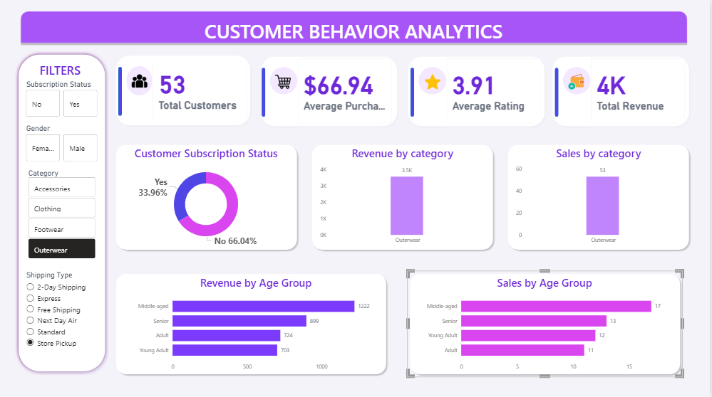

# 📊 Customer Behavior Analysis — End-to-End Data Analyst Project

<div align="center">


**An end-to-end data analytics project focused on customer purchasing behavior analysis using Python, SQL, Jupyter Notebook, and Power BI.**

</div>

---

# 📌 Project Overview

This project analyzes customer purchasing behavior and sales trends to identify meaningful business insights.

The project includes:
- Data Cleaning using Python
- Exploratory Data Analysis (EDA)
- SQL-based business queries
- Interactive Power BI Dashboard
- Customer segmentation analysis
- Revenue & sales analysis

The main objective of this project is to help businesses understand customer behavior and make data-driven decisions.

---

# 🖼️ Dashboard Preview

<div align="center">



</div>

---

# 📂 Dataset Information

| File Name | Description |
|---|---|
| `Customer Behavior.csv` | Contains customer purchase and sales data |

---

# 🛠️ Technologies Used

| Tool / Technology | Purpose |
|---|---|
| Python | Data Cleaning & Analysis |
| Pandas | Data Manipulation |
| NumPy | Numerical Operations |
| Matplotlib | Data Visualization |
| Seaborn | Statistical Visualization |
| SQL | Business Query Analysis |
| Jupyter Notebook | Exploratory Data Analysis |
| Power BI | Interactive Dashboard |

---

# 📊 Project Workflow

## 1️⃣ Data Collection
- Imported customer behavior dataset from Kaggle
- Loaded dataset into Jupyter Notebook for analysis

---

## 2️⃣ Data Cleaning using Python
Performed:
- Null value handling
- Duplicate removal
- Data type corrections
- Column formatting
- Feature engineering

---

## 3️⃣ Exploratory Data Analysis (EDA)
Analyzed:
- Customer demographics
- Purchase behavior
- Revenue trends
- Product category performance
- Shipping preferences
- Review ratings

Used:
- Bar charts
- Count plots
- Histograms
- Heatmaps

---

## 4️⃣ SQL Analysis
Used SQL queries for:
- Revenue analysis
- Top-performing categories
- Customer segmentation
- Review analysis
- Shipping analysis

Example SQL Query:

```sql
SELECT category,
SUM(purchase_amount) AS total_revenue
FROM customer
GROUP BY category
ORDER BY total_revenue DESC;
```

---

## 5️⃣ Power BI Dashboard
Built an interactive dashboard featuring:
- KPI cards
- Revenue analysis
- Sales analysis
- Age-group insights
- Subscription analysis
- Interactive slicers

---

# 📈 Key Dashboard Metrics

| Metric | Value |
|---|---|
| 👥 Total Customers | 3.9K |
| 💰 Average Purchase Amount | $59.76 |
| ⭐ Average Review Rating | 3.75 |
| 🛒 Total Revenue | 233K |

---

# 📊 Visualizations Used

| Visualization | Purpose |
|---|---|
| KPI Cards | Business metrics |
| Donut Chart | Subscription distribution |
| Column Charts | Category analysis |
| Bar Charts | Age-group analysis |
| Slicers | Interactive filtering |

---

# 🔍 Key Insights

| # | Insight |
|---|---|
| 👕 | Clothing category generated highest revenue |
| 👥 | Young adults contributed highest sales |
| 🚚 | Standard shipping is most preferred |
| ⭐ | Average customer rating is 3.75 |
| 📊 | Non-subscribed customers dominate the customer base |

---

# ⚙️ Power BI Features Implemented

## ✅ DAX Measures

```DAX
Total Revenue = SUM(customer[purchase_amount])

Total Customers = DISTINCTCOUNT(customer[customer_id])

Average Rating = AVERAGE(customer[review_rating])

Average Purchase = AVERAGE(customer[purchase_amount])
```

---

# 📁 Project Structure

```bash
customer-behavior-analysis-end-to-end-project/
│
├── Dataset/
│   └── Customer Behavior.csv
│
├── SQL/
│   └── customer_analysis_queries.sql
│
├── Jupyter Notebook/
│   └── customer_behavior_analysis.ipynb
│
├── Power BI Dashboard/
│   └── CUSTOMER BEHAVIOR ANALYTICS.pbit
│
├── Images/
│   └── dashboard-preview.png
│
├── README.md
│
└── requirements.txt
```

---

# 🚀 How to Run This Project

## Python & Jupyter Notebook

1. Install required libraries

```bash
pip install pandas numpy matplotlib seaborn jupyter
```

2. Open Jupyter Notebook

```bash
jupyter notebook
```

3. Run:
```bash
customer_behavior_analysis.ipynb
```

---

## Power BI Dashboard

1. Open `.pbit` file in Power BI Desktop
2. Load CSV dataset
3. Refresh dashboard
4. Explore insights using slicers

---

# 📌 Business Use Cases

This project helps businesses:
- Understand customer purchasing behavior
- Identify top-performing product categories
- Improve shipping strategies
- Monitor revenue performance
- Analyze customer satisfaction
- Make data-driven business decisions

---

# 👤 Author

## Aditya Bhoi

- 🔗 LinkedIn: www.linkedin.com/in/adityabhoi
- 🐙 GitHub: github.com/AdityaBhoi

---

<div align="center">

⭐ If you found this project useful, give it a star! ⭐

Made with ❤️ using Python, SQL & Power BI

</div>
